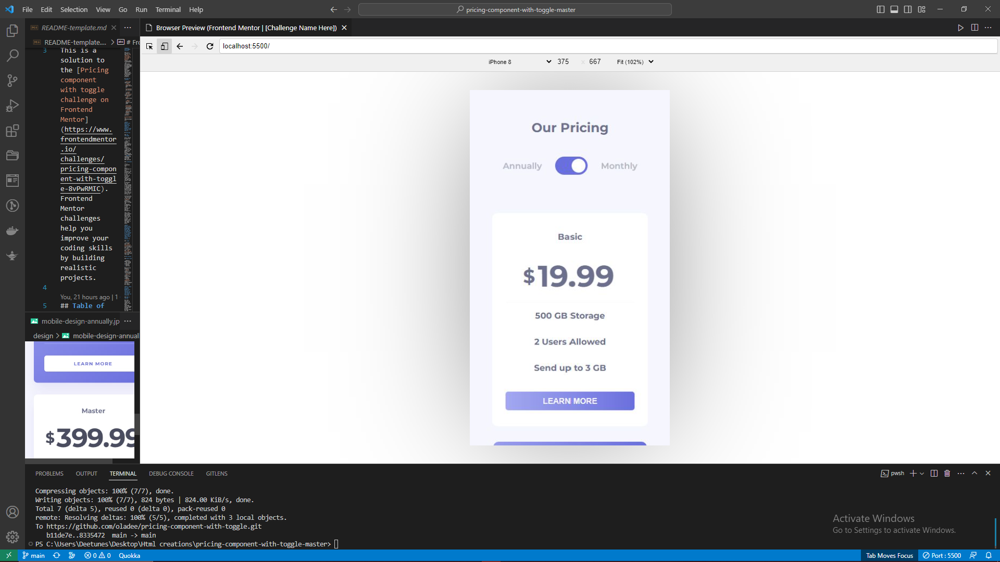
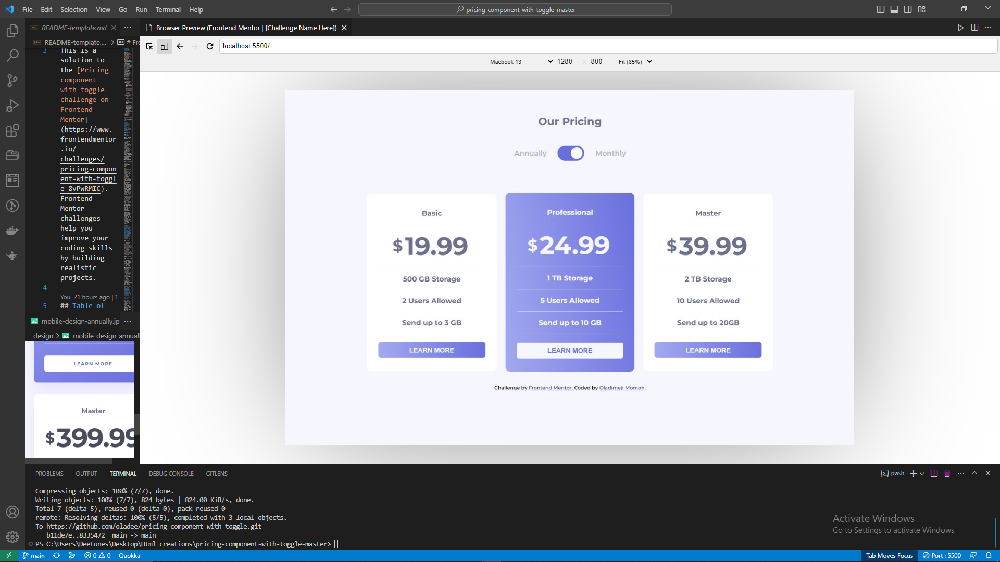

# Frontend Mentor - Pricing component with toggle solution

This is a solution to the [Pricing component with toggle challenge on Frontend Mentor](https://www.frontendmentor.io/challenges/pricing-component-with-toggle-8vPwRMIC). Frontend Mentor challenges help you improve your coding skills by building realistic projects. 

## Table of contents

- [Overview](#overview)
  - [The challenge](#the-challenge)
  - [Screenshot](#screenshot)
  - [Links](#links)
  - [Built with](#built-with)
  - [Continued development](#continued-development)
- [Author](#author)

**Note: Delete this note and update the table of contents based on what sections you keep.**

## Overview

### The challenge

Users should be able to:

- View the optimal layout for the component depending on their device's screen size
- Control the toggle with both their mouse/trackpad and their keyboard
- **Bonus**: Complete the challenge with just HTML and CSS

### Screenshot

### Links

- Solution URL: [pricing component with toggle](https://oladee.github.io/pricing-component-with-toggle/)
- Live Site URL: [Repo link](https://github.com/oladee/pricing-component-with-toggle)

### Built with

- Semantic HTML5 markup
- CSS custom properties
- Flexbox
- Mobile-first workflow
### What I learned

For this project, i learnt how vital dom manipulation is and how it has formed a bed rock for so many single page applications

### Continued development

Over my next few projects i hope to dive fully into single page applications fully using the react library and also involve myself with some of its frameworks

### Useful resources

## Author

- Website - [Momoh Oladimeji](https://www.github.com/oladee)
- Frontend Mentor - [@oladee](https://www.frontendmentor.io/profile/oladee)